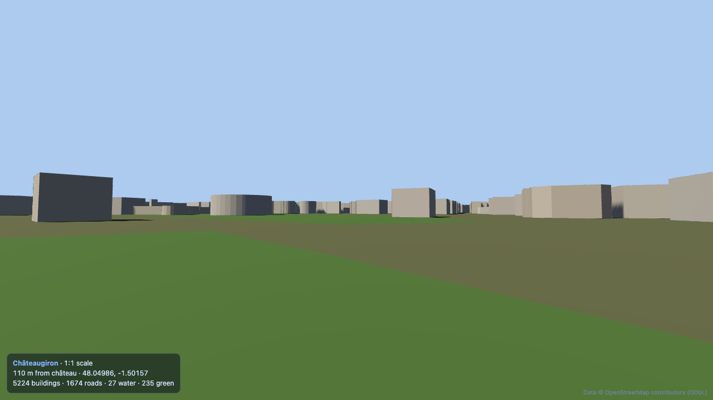

# Châteaugiron 3D

Walk the real town of [Châteaugiron](https://en.wikipedia.org/wiki/Ch%C3%A2teaugiron) (Brittany, France) at true 1:1 scale, in your browser. This is **V0**: the whole historic core built automatically from free OpenStreetMap data and rendered with three.js.



## What V0 does

- Loads real map data around the medieval château (5,000+ buildings, roads, the étang, green spaces).
- Extrudes every building to its real height (from OSM `height` or `building:levels`).
- Projects everything to metres on a plane centred on the château, so distances are real 1:1.
- Lets you walk it in first person with sun, shadows, sky and fog.

Everything renders from one committed data file, so it runs offline after `npm install`.

## Quick start

```bash
npm install
npm run dev
```

Open the printed local URL, click **Enter Châteaugiron**, then:

| Key | Action |
| --- | --- |
| `W` `A` `S` `D` | Move |
| Mouse | Look |
| `Shift` | Run |
| `Esc` | Release the mouse |

To rebuild the map data (for example a larger radius):

```bash
npm run fetch-data 2500   # radius in metres around the château
```

## How it works

```
OpenStreetMap (Overpass API)
        |  scripts/fetch-osm.mjs
        v
public/data/chateaugiron.json   (buildings, roads, water, green)
        |  src/geo.js      lon/lat  ->  metres (1:1)
        |  src/world.js    extrude buildings, road ribbons, water, greens
        |  src/controls.js first-person walk
        v
   three.js scene in the browser (src/main.js)
```

- `scripts/fetch-osm.mjs` queries the Overpass API and writes a trimmed JSON.
- `src/geo.js` converts longitude and latitude to local metres on a tangent plane, +X east, +Z north.
- `src/world.js` builds the meshes: buildings are merged into one coloured mesh, roads are flat ribbons, water and greens are triangulated polygons.
- `src/main.js` sets up the renderer, sun, shadows, sky, the HUD and the loop.

## Scope and roadmap

V0 is the fast, free base layer. The plan to reach the full "hyper-realistic, whole town, explorable interiors" goal is layered, so the town stays complete and playable while fidelity rises over time.

1. **Base layer (done in V0):** whole core from OpenStreetMap, buildings at real heights.
2. **Terrain and better shells:** IGN LiDAR HD, BD TOPO and cadastre (all open, Etalab licence) for real ground relief and accurate heights across the whole 23.52 km² commune.
3. **Hero layer:** drone or [Panoramax](https://panoramax.fr) capture of the château and old town, turned into photogrammetry meshes or 3D Gaussian splats for true photorealism.
4. **Interiors:** procedural, enterable interiors everywhere, plus hand-crafted interiors for landmarks (château, church, mairie). There is no open interior data, so interiors are authored.
5. **Streaming:** tiled 3D Tiles or tiled splats with level of detail, so a browser can stream the whole commune.

## Data and licence

- Map data © OpenStreetMap contributors, licensed under the [ODbL](https://www.openstreetmap.org/copyright). The file in `public/data/` is derived from OpenStreetMap.
- Code is released under the MIT licence. See `LICENSE`.

## Stack

- [three.js](https://threejs.org) for rendering
- [Vite](https://vitejs.dev) for the dev server and build
- [OpenStreetMap](https://www.openstreetmap.org) via the [Overpass API](https://overpass-api.de) for data
